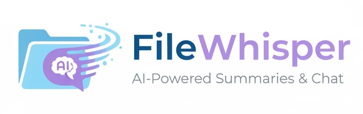

<p align="center">
  
</p>

**FileWhisper** is an AI-powered application that lets users upload **TXT** or **PDF** files, receive instant **summaries**, and **chat with an AI model** about the file’s content.  

It’s built with a **FastAPI backend**, a **React/Next.js web frontend**, and a **native Android app**, all powered by **MongoDB** for data storage.

---

## 🚀 Features
- 📤 Upload **TXT** or **PDF** files  
- 🤖 Get **AI-powered summaries** of your documents  
- 💬 **Chat with AI** to ask questions about the file  
- ⚡ **FastAPI backend** for high-performance APIs  
- 🌐 **Modern React/Next.js frontend** for web users  
- 📱 **Android mobile app** for on-the-go access  
- 🗄️ **MongoDB database** to store file data, chat history, and metadata  

---

## 🛠️ Tech Stack
- **Backend:** [FastAPI](https://fastapi.tiangolo.com/) (Python)  
- **Database:** [MongoDB](https://www.mongodb.com/)  
- **Frontend (Web):** [React](https://react.dev/) + [Next.js](https://nextjs.org/)  
- **Frontend (Mobile):** Native Android (Java/Kotlin)  
- **AI Model:** Gemini API 

---

## 📂 Project Structure
```
FileWhisper/
├── backend/ # FastAPI backend
│ ├── app/ # API endpoints, services, models
│ ├── requirements.txt
│ ├── Dockerfile
│ └── ...
├── web-frontend/ # React + Next.js frontend
│ ├── src/
│ │ └── app/
│ ├── public/
│ ├── Dockerfile
│ └── ...
├── android-app/ # Android mobile app
│ ├── app/
│ └── ...
├── docker-compose.yaml # Docker Compose config for multi-service setup
├── start.sh # Bash script to start the project (MAC & Linux)
├── start.ps1 # PowerShell script to start the project (Windows)
└── README.md
```


---

## ⚙️ Installation & Setup

### 1. Clone the Repository
```bash
git clone https://github.com/galhelner/FileWhisper.git
cd FileWhisper
```

### 2. Run Backend & Web Frontend

On **Linux / macOS**:
```bash
./start.sh
```

On **Windows (PowerShell)**:
```bash
./start.ps1
```

➡️ These scripts will start the backend and frontend using Docker Compose,
and automatically open your default browser at http://localhost:3000

### 3. Android Frontend App
* Open android-app-frontent in Android Studio
* Sync Gradle and run on an emulator or device
* **Make sure that the backend server is running!** 

---

## 📖 Usage

1. Open the web app or Android app
2. Upload a TXT or PDF file
3. View the AI-generated summary
4. Ask questions and chat with AI about the file

---

## 👨‍💻 Author
**Gal Helner**
Built with ❤️ using FastAPI, MongoDB, React, and Android.
